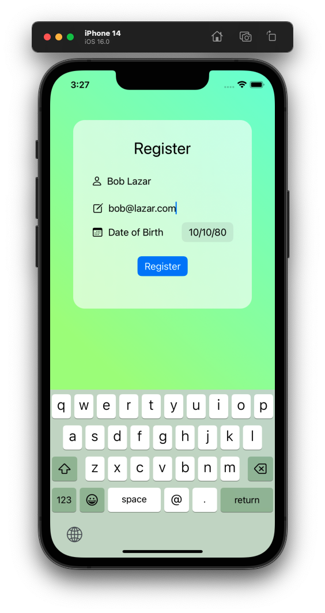
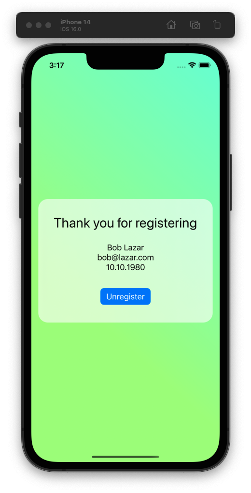
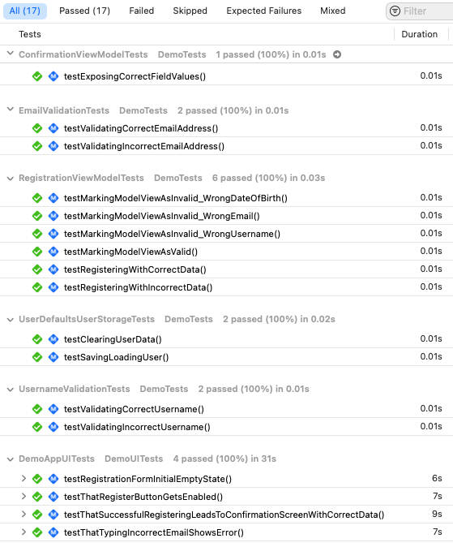
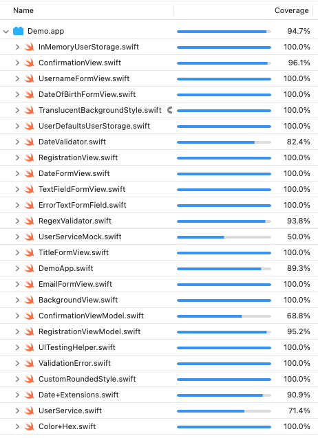

# SwiftUI MVVM Demo App

Demo app consisting of two screens - Login and Confirmation - showcasing the use of SwiftUI and MVVM architecture. The project shows how to achieve solid separation of concerns and enhanced testability.

Registration | Confirmation
:-:|:-:
 |  

## Architecture Overview

The app utilizes **MVVM** architecture. I chose MVVM because of:

- separation of concerns
- improved testability
- to make the project structural and simple to manage

### User Flow

- When the app starts it tries to load saved user data from the store (`UserDefaults`).
- If there is no user data, registration screen is shown.
- After collecting registration data from the user, the app saves it and the user is taken to the confirmation screen.
- If the user data is loaded from the store at the app startup, the app proceeds straight to the confirmation screen. The user has an option to unregister which clears user data and shows the registration screen again.  

### Key Types

The app contains 2 pages - registration and confirmation screens. The following table lists key types used to build the app.

Model & Data Layer | ViewModel | View |
:-:|:-:|:----:
`User` `UserStorage` `UserService` | `RegistrationViewModel` `ConfirmationViewModel` | `RegistrationView` `ConfirmationView` |

Additionally, there is a set of types responsible for input validation: `Validator`, `RegexValidator`, `DateValidator`, `RegexRule`.

#### Registration

The registration page centers around collecting information entered by the user. The UI layout is defined in `RegistrationView`; it is based on a `Form` view and a set of accessory views.

`RegistrationView` is backed by its view model (`RegistrationViewModel`) that acts as the intermediary between model/data layer (`User`, `UserService`) and the view. It validates the data entered by the user (via types implementing the `Validator` protocol). Additionally, it retrieves the actions from the view (e.g. tapping on the *Register* button).

#### Confirmation

The confirmation page shows the information about the user. In this case, it's the information collected in the registration page. However, neither confirmation view (`ConfirmationView`) nor its view model (`ConfirmationViewModel`) know anything about the registration. They rely solely on the data layer as a single **source of truth**.

#### Navigation

This is where I faced the biggest challenge. I noticed that in SwiftUI, navigation and flow control is confined to the view layer (e.g. `NavigationLink` in views).

However, what I wanted was to achieve a higher level of view reusability and testability. I wanted the views not to know about each other.

In my solution, the app instance (`DemoApp`) acts as a router, deciding which UI components to show.

## Testing strategy

- The app ships with **17** tests that fall into 3 categories: unit, integration and UI. Classic unit testing is done for the validation logic (`EmailValidationTests`, `UserDefaultsUserStorageTests`). Tests from the integration category can be found in e.g. `RegistrationViewModelTests`. There is also a set of UI tests, verifying that the main user flow works as expected (`DemoAppUITests`).

- I wanted to achieve high code coverage. The current value sits at **94%**. Although the metric is obviously not perfect,  it is a great indicator for deciding whether particular parts of code need more testing.

Tests | Code coverage
:-:|:-:
 |  

### Dependency Injection

All the main classes in the app allow for constructor dependency injection. I wanted this in order to be able to be flexible when testing. Constructor injection might not be the most scalable way of injecting - however, it is a valid pattern and does the job, keeping things separated. Mock classes were added to be used in tests (e.g. `InMemoryUserStorage`, `UserServiceMock`)

### New Build Configuration - TESTING - But Why?

I added a new build configuration (`Testing`). The main reason of this was that I wanted to be able to exclude SwiftUI previews from code coverage computation. 

To exclude code from code coverage computation I can simply wrap it with `#if !TESTING ... #endif`.

## What Next?

There are certain things I'd like to improve. Since this was my first SwiftUI project I certainly did not choose the best solutions. Sometimes, I cut the corners not to spend too much time on perfecting things. The following list contains things that I'd like to improve:

- Make the `UserService` calls asynchronous to fit real-world scenarios of registering. The work on it has been started in the `promises-in-storage` branch. I'm refactoring it to use Combine's Promise pattern.

- Better UI routing. Now it's the main app struct doing the routing. I'd like to change this and try the new API from Apple - iOS 16's `NavigationStack`

- Improve animations. SwiftUI animations is something I have not explored much in this project. I'd like to change that.

- More functional reactive programming using Combine. I barely touched the surface in this project using Combine. It looks like something that could save lots of time and reduce the amount of boilerplate code in the project.
